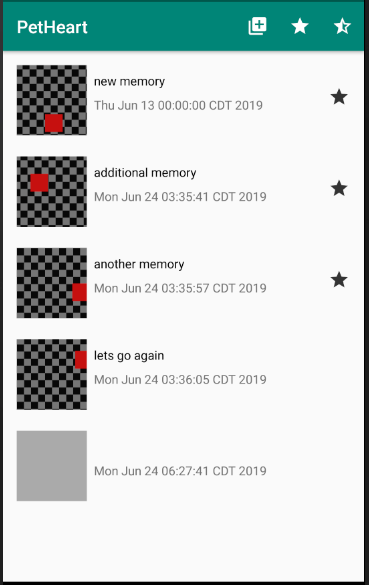
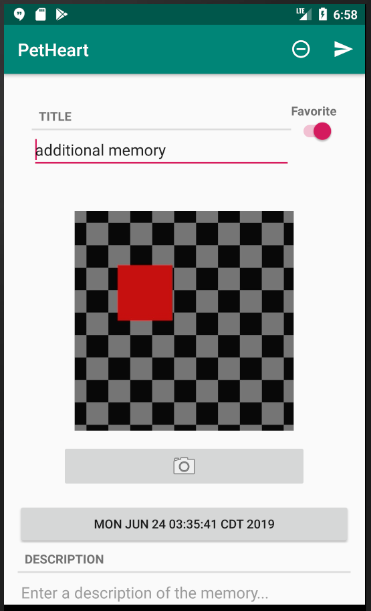

# COP 3665 - Mobile Programming

#Due - July 15th, 2020

# Project 3 - The Memory Maker for Pet Lovers

## Objective:

This project is meant to help you understand the basics of working with fragments, intents, and user interface elements. This project builds upon the project that we have been building throughout the videos. You will need to adhere to the constraints given in this description and ensure that you are completing all objectives. 

## Learning Outcomes:

Develop a mobile program that uses:

- RecyclerView and ViewPager
- Implicit Intents
- Constraint Layouts
- Fragments
- Working with SQLite

In addition:

- Gain familiarity with submitting your work through Github (This is a common industry tool and the more comfortable you get with version control before graduating, the better)

## Preparation:

To complete this project, you need to make sure that you have read and watched all material from the first half of the course. You also need to ensure that you have familiarity with concepts covered in Intermediate Programming.

## Problem Description:

You are tasked to create a memory maker application that builds upon the discussion from the first half of the course. Using this application, users can take pictures and record details of the memories that they make with their pets. Users can save their memories to their device using the file system and a SQLite database. Furthermore, users can favorite their memories and send reminders of past events through other apps on their phone. Users should be able to filter memories by favorites, and delete and edit old memories. 

## Overview of the Interface:

You must provide two different activities in your program, and create three different fragment classes. The first activity brings up a RecyclerView that lists all memories currently in the database. You will notice that there are three items in the toolbar. The first item allows the user to create a new memory. The second item allows users to filter the list in the RecyclerView to only show those memories that are favorited. This filtering should be handled by a repository class you use to store a collection of memories and not by the fragment class (i.e., create a getFavorites method along with a getMemories method in a collection class). The final item shows all memories whether they are favorited or not (this is the default view). 

The content of the activity belongs to a fragment. Each item in the RecyclerView gives a thumbnail which is a smaller version of the image taken when the memory was created. Each item also includes the title, date, and an icon on the right hand side that indicates whether the memory was favorited or not. You do not have to match margins and padding exactly, but you should be able to get items positioned similar to what is shown in the image. If a photo has not been taken, then you should show a gray square as shown in the image. 

The second activity is the details activity. In the toolbar of this activity, you will see two items. The first item will delete the current memory and send the user back to the memory list. The second item will allow the user to send details of the memory through another application, such as an email application like Gmail. To do this, you should be filling in a template string as was done with the crime report. A template string that you can use is as follows: Remember %1s! It happened on %2s. Remember %3s! (the first item is the title, the second is the date, and the last is the description).

Inside of each fragment, you will see a label indicating the title above an EditText. On the right hand side is a switch that can be toggled for whether the memory is a favorite. You should be able to line the title and switch up as is shown in the image using the proper layout. Below the title and switch, you will see an ImageView. This ImageView is centered to the screen above a button for the camera. Pressing on the button should trigger the device's camera and allow the user to take a picture which will then fill in the ImageView. Below the camera button is a button to select a date for which the memory took place. Once pressed, it will bring up a dialog with a DatePicker. At the bottom is a Description. The Description also uses an EditText, but it is sized as to allow multiple lines to be able to be seen at once. A user begins typing at the beginning of the box's hint (i.e., Enter a desc...), which should be at the top left corner of the box. Notice that the EditText continues off the screen. In order to allow for the user to access all parts of the fragment, the fragment should be scrollable (look into ScrollView). 

Note that there are some differences from the videos that you will need to work through. You should explore online documentation and get a better understanding of how some of the common user interface components such as RecyclerView work.

### Sample run of program

The image below links to a [video](https://youtu.be/szX3l1C50fA) of a sample execution of the program solution.

## Additional Files:

I will not dictate exactly what classes you will need. However, a note about organization, you should separate your concerns and responsibilities. Create new packages to store classes handling database, repository, modeling, and utility information as was done in the videos. It is not a good idea to combine responsibilities (e.g., view information with database queries and models) into the same classes. This is creating a mess that someone will eventually have to clean up (often times yourself). 

## Additional Requirements:

Your application must function as described below:

1. Your program must adhere to the all requirements provided in this description.
2. Your program must perform the functionality displayed in the video.
3. Any constants should be kept inside their appropriate xml files (this includes strings and colors). 

## Important Notes:

- Projects will be graded on whether they correctly solve the problem, and whether they adhere to good programming practices.
- Projects must be received by the time specified on the due date. Projects received after that time will get a grade of zero.
- Do not change any of the files given to you unless told to. 
- Please review the academic honesty policy.
  - Note that viewing another student's solution, whether in whole or in part, is considered academic dishonesty.
  - Also note that submitting code obtained through the Internet or other sources, whether in whole or in part, is considered academic dishonesty. 

## Submission Instructions:

1. All code must be added and committed to your local git repository.
2. All code must be pushed to the GitHub repository created when you "accepted" the assignment.
   1. After pushing, visit the web URL of your repository to verify that your code is there.
      If you don't see the code there, then we can't see it either.
3. Your code must compile and run in a Nexus 5X emulator with API 24 or it might not be graded.
   1. If your program will not compile, the graders will not be responsible for trying to test it.
